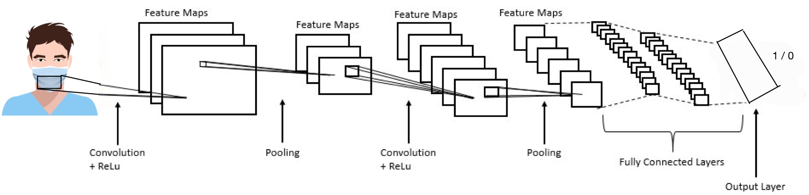

# Face-Mask-Detection-Deep-Neural-Network-Triple-Solution
Three types of solutions to the Mask-Detection problem where the first is presented in the form of a Convolution Neural Network, the second in a network that is Fully Connected Neural Network and the third is based on a Transfer Learning Neural Network.All three them were implemented with Tensorflow Keras.

<ul>
  <li>
    <h2>Background</h2>
    This report describes the mask detection problem and its solution. It contains three configurations that describe three different neural networks: the first, a Fully Connected Network. The second, transfer-learning based network and the third, a Convolutional neural network. 
In this report you will find the complete process of solving this problem using the models described above and additional information such as graphs, code lines screenshots, Loss vs Validation, and other ML concepts that will contribute to the understanding of our project.

  </li>
  
  <li>
    <h2>Data Description</h2>
    The data used for training the model contains 10,000 images which half of them shows a person with a face-mask and the other half non-masked faces.The data we are using contains a validation set, with 1000 pictures, 500 masked-faces and 500 non-masked faces.
The third set, used for testing the model, contains 1000 pictures, 500 masked-faces and 500 non-masked faces.
The data you can get for free from www.kaggle.com from the link <a href="https://www.kaggle.com/ashishjangra27/face-mask-12k-images-dataset
">Here</a>
  </li>
  
   <li>
    <h2>Networks and Architecture</h2>
  <li> <b>The first configuration</b> was built by from end to end, the architecture used in this configuration is CNN-Convolutional Neural Network which consists of several layers that implement feature extraction, and then classification.
    The CNN model:
      

     CNN layers:
        

       <li> <b>The second configuration</b> is a Transfer-Learning configuration, in that case we used the MobileNet V2 architecture. 
MobileNetV2 is a convolutional neural network architecture that seeks to perform well on mobile devices. 
It is based on an inverted residual structure where the residual connections are between the bottleneck layers.
We fine-tuned MobileNetV2 on our mask/no mask dataset and obtained a classifier.
In MobileNetV2, there are two types of blocks:
One is a residual block with stride of 1. Another one is a block with stride of 2 for downsizing.
There are 3 layers for both types of blocks.This time, the first layer is 1×1 convolution with ReLU6.	The second layer is the depthwise convolution.
The third layer is another 1×1 convolution but without any non-linearity. It is claimed that if RELU is used again, the deep networks only have the power of a linear classifier on the non-zero volume part of the output domain.to the network we imported we added a few fully connected layers of our own.
      
   I deleted 6 layers from the end of the network and added 1 Danse layer with Softmax function,because we need to know if the person is wearing a mask(0) or not(1).In addition, 23 layers from the end of network weren't trainable.
         
 The Transfer-Learning model:

         

         <li> <b>The third configuration</b> is Fully Connected Neural Network which consists of several Fully Connected hidden layers. 
Fully Connected layer is a function from ℝ m to ℝ n. Each output dimension depends on each input dimension. 
           
The Fully Connected Neural Network layers:

        
  
   <li>
    <h2>Training Results</h2>
      Loss and Accuracy CNN:
   
  </li>
  
   <li>
    <h2>Conclusion</h2>
    example example example
  </li>
</ul>

